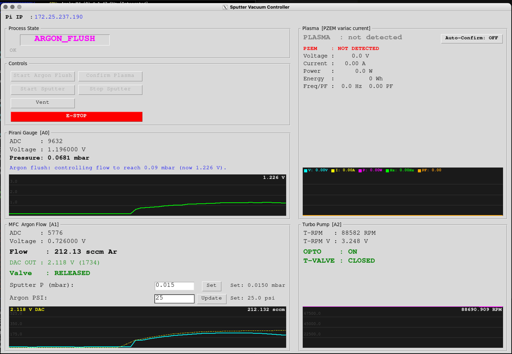

# Sputter Vacuum Controller

A Raspberry Pi-based vacuum process controller for DC magnetron sputter deposition. Manages chamber pump-down, argon gas flow, plasma ignition, and sputtering via a live Tkinter GUI with scrolling sensor graphs and a hardware-interlocked state machine.



---

## Table of Contents

- [Hardware Overview](#hardware-overview)
- [Software Architecture](#software-architecture)
- [File Structure](#file-structure)
- [State Machine](#state-machine)
- [Pressure Reference](#pressure-reference)
- [Installation](#installation)
- [Running](#running)
- [Remote GUI Access](#remote-gui-access)
- [Configuration](#configuration)
- [GUI Guide](#gui-guide)
- [Known Limitations](#known-limitations)
- [Roadmap](#roadmap)

---

## Hardware Overview

| Component | Model | Interface | Notes |
|---|---|---|---|
| Microcontroller | Raspberry Pi 2B (BCM GPIO) | — | Host for all control logic |
| Pirani gauge | ACE Instruments DHPG-015 | Analog 0–10V | Divided to 0–3.3V before ADC (ratio 0.33) |
| ADC | ADS1115 | **I2C bus 3** @ 0x48 | Pirani on A0 (divided), MFC feedback on A1 (divided), turbo RPM tach on A2 |
| MFC | MKS 1179A | Analog 0–5V setpoint | 0–700 sccm Argon |
| DAC | MCP4725 | **I2C bus 3** @ 0x60 | Level-shifted to the MFC's full 0–5V setpoint range — see below |
| DAC buffer | LM358P op-amp | Analog | Buffers + level-shifts the DAC output up to 0–5V; DAC alone cannot drive the MFC setpoint input |
| Turbo enable | Opto-isolator (4N35) | GPIO 17 (BCM, phys 11) | Marginal — needs BC547 output buffer, see below |
| MFC valve close | Emergency shut | GPIO 27 (BCM, phys 13) | Pulls MFC valve closed on demand |
| Turbo inlet valve | Relay via BC547 | **GPIO 22 (BCM, phys 15)** | HIGH = valve OPEN, LOW = valve CLOSED (relay NC contact) |
| Energy meter | PZEM-004T-100A | Modbus-RTU over CP2102 USB-TTL, `/dev/ttyUSB0` | AC voltage/current/power on the variac output; plasma-ignition sensing. **Optional at startup** — see below |

### I2C: Software Bus 3 on GPIO 23/24

I2C runs as a **bit-banged software bus** via device-tree overlay in `/boot/firmware/config.txt`:

```
dtoverlay=i2c-gpio,bus=3,i2c_gpio_sda=23,i2c_gpio_scl=24,i2c_gpio_delay_us=2
```

| Signal | BCM | Physical pin |
|---|---|---|
| SDA | GPIO 23 | 16 |
| SCL | GPIO 24 | 18 |

The code opens the bus with `ExtendedI2C(I2C_BUS_NUMBER)` from `adafruit-extended-bus` (bus number set in `config.py`; switch back to `1` if hardware I2C is ever restored). **Note:** unlike pins 3/5, GPIO 23/24 have no on-board pull-ups — the breakout boards' 10 kΩ pull-ups are what keeps the bus alive. Bare chips would need external 4.7 kΩ pull-ups to 3.3 V.

Software bus speed is slower than hardware I2C; irrelevant at the 0.2 s polling rate. A harmless "I2C frequency is not settable in python" warning is printed at startup.

### Voltage Divider (Pirani Output)

The DHPG-015 outputs 0–10V. A 3-resistor voltage divider scales this to 0–3.3V for the ADS1115 (divider ratio 0.33). All pressure thresholds in `config.py` are expressed in post-divider (ADC-side) volts. The full manufacturer calibration table lives in `Docs/Di-Hi-Pr-Pirani output voltage.pdf` and is transcribed as `_PIRANI_CAL` in `main.py`.

### DAC Output Buffer + Level Shifter (LM358P)

The MCP4725 cannot source enough current to drive the MFC setpoint input directly — above ~1.25V the output voltage collapses under load even though it reads correctly when unloaded. An LM358P stage buffers the DAC output and shifts it up to the MFC's full 0–5V setpoint range before it reaches the MFC (`ARGON_DAC_VREF = 5.0` in `config.py` reflects this — commanded flow covers the full 0–`MFC_FULL_SCALE` range, not a fraction of it):

```
DAC OUT ──────────────┬──── LM358 IN+ (pin 3)
                       │
                  (feedback) IN- (pin 2) ──── OUT (pin 1) ──── MFC setpoint
LM358 VCC (pin 8) ── Pi 5V
LM358 GND (pin 4) ── GND
```

Power the op-amp from the Pi's **5V** rail, not 3.3V. The diagram above shows the original current-buffer wiring; the gain-setting feedback network that shifts the output up to 0–5V isn't captured in this ASCII diagram.

### Turbo Inlet Valve (GPIO 22 → BC547 → Relay → Solenoid)

The turbo inlet solenoid valve (~50 mA @ 25–26 V) is switched by a relay, driven by a BC547:

```
GPIO22 ──470Ω── base   BC547   collector ── relay coil ── +5V
                          emitter ── GND         ▲
                                          1N4007 across coil
                                          (band toward +5V)

Valve circuit ── relay COM + NC contacts (isolated from the Pi)
```

- Valve is wired through the relay's **NC (normally closed)** contact: relay released = valve circuit shorted = **valve CLOSED**; relay energized = **valve OPEN**.
- Logic (in `_poll()`, `turbo_valve_step()`): valve held CLOSED at all times; **latched OPEN** during **VENTING** once turbo pump RPM (tach on ADC A2, see [Turbo Pump RPM](#turbo-pump-rpm-adc-a2)) sustains `TURBO_VALVE_CONFIRM_SAMPLES` consecutive reads at or below `TURBO_VALVE_OPEN_RPM_MAX` (35000 RPM); re-closed automatically on leaving VENTING. The debounce prevents a single corrupted I2C read from opening the valve; the latch prevents relay chatter once open. Driven by rotor speed directly rather than inferring it from chamber pressure — the earlier pressure-based gate (`TURBO_VALVE_OPEN_MBAR`) has been replaced.
- Fail-safe: if the Pi crashes or loses power, the relay releases and the valve **fails closed** — the safe direction for the turbo inlet.
- GUI shows live actuation state (`T-VALVE : CLOSED` / `OPEN (venting)`).

### Turbo Pump RPM (ADC A2)

- Tach/speed output, 0–3.3V linear = 0–90000 RPM (`TURBO_RPM_VOLTAGE_FULL_SCALE`, `TURBO_RPM_FULL_SCALE`), read by `TurboRPMController` (`turbo_rpm.py`) every poll tick regardless of state.
- Displayed in its own **Turbo Pump** panel (`T-RPM`, `T-RPM V`, a scrolling RPM graph, plus `OPTO` and `T-VALVE` state — both turbo-side actuators, moved here from the Pirani panel) — below the Plasma panel, beside the Pirani/MFC panels.
- During **VENTING**, once RPM drops to/below `VENTING_PUMP_OFF_PROMPT_RPM` (2000), the Pirani panel's status message turns orange and prompts the operator to turn off the primary/roughing pump — an early, informational cue, not a gate. The actual gate on completing the vent is separate — see [Vent Completion Confirmation](#vent-completion-confirmation) below.
- Feeds the turbo inlet valve interlock above and the cross-sensor checks below.

### Vent Completion Confirmation

Reaching atmospheric pressure during VENTING does **not** by itself complete the vent. Earlier, `sm.update()` transitioned `VENTING → IDLE` purely from Pirani voltage — but the turbo inlet valve closes the instant the state leaves VENTING (`turbo_valve_step()`), so that auto-transition could reclose the valve before the operator had any real chance to react to the "turn off the primary pump" cue above, let alone actually do it.

`VENTING → IDLE` is now owned exclusively by `_poll()` (the same ownership pattern as `ARGON_FLUSH → PLASMA_IGNITING`), gated by `vent_complete_ready()`: **both** atmospheric pressure **and** an explicit operator click are required.

- Once Pirani reaches `VENTING_COMPLETE_VOLTAGE` during VENTING, `_state["vent_complete_pending"]` latches True — the Pirani panel's status message turns red ("Atmosphere reached — turn OFF the primary/roughing pump, then click Confirm Pump Off") and a **Confirm Pump Off** button appears in Controls (hidden otherwise, same show/hide pattern as Clear Fault).
- Clicking it sets `_state["vent_complete_confirmed"]`; `_poll()` picks this up on its next tick and, if pressure is still at/above atmosphere, transitions to IDLE — closing the turbo inlet valve as part of the normal VENTING-exit path.
- Both flags reset on entering IDLE or VENTING (`handle_hardware_interlocks()`), so a stale confirmation from a previous cycle can never auto-complete the next one.

### Energy Meter (PZEM-004T-100A, plasma ignition sensing)

Reads AC voltage/current/power/energy/frequency/power-factor on the sputtering supply's **variac output** and uses the current-draw step when the discharge strikes to detect plasma ignition. Talks Modbus-RTU over a CP2102 USB-TTL adapter plugged into the Pi's USB port (`pzem_meter.py`) — a completely separate transport from the ADS1115/MCP4725 I2C bus above.

> [!warning] Mains AC hazard
> The PZEM's voltage-sense terminals and current-transformer (CT) clamp are on **live mains-derived AC**, not the Pi's low-voltage side. Work de-energized (variac and upstream breaker off), verify with a meter before touching any terminal, don't work alone, and don't exceed the CT's 100A rating. The PZEM's internal isolation protects the TTL/USB side from the AC side *once wired correctly* — it does not protect you while wiring it.

#### Wiring

**AC side (mains, de-energized while wiring):**

- Connect the PZEM's **L / N voltage-sense terminals directly across the variac's OUTPUT** (not its input) — the two wires feeding whatever the variac drives (typically an HV/isolation transformer feeding the sputtering cathode supply).
- Clamp the **split-core CT around the same variac output's live (L) conductor** — do not clamp both L and N together (their fields cancel and it reads ~0A), and do not clamp the input side.
- Wiring the CT and voltage sense to the *same* side (output) is required for the power reading to mean anything — the PZEM computes P = V × I × PF locally, so V and I must reflect the same node.
- This placement means voltage/current/power all read what's actually delivered to the sputtering supply, independent of the variac's own tap position — exactly the load signature that changes when the discharge strikes (impedance drop → current step).

**TTL side (isolated, low-voltage, safe to wire live):**

| PZEM TTL pin | CP2102 pin | Notes |
|---|---|---|
| 5V  | 5V  | PZEM-004T v3.0's TTL interface requires 5V — verify the CP2102's voltage-select jumper (if it has one) is set to 5V, not 3.3V |
| GND | GND | Common ground |
| TXD | RXD | Cross — PZEM transmits into the adapter's receive pin |
| RXD | TXD | Cross — PZEM receives from the adapter's transmit pin |

Plug the CP2102 into any Pi USB port. It enumerates as `/dev/ttyUSB0` (check with `ls /dev/ttyUSB*`; use a `/dev/serial/by-id/...` symlink instead if more than one USB-serial device is ever attached). The Pi user needs the `dialout` group to access it without root:

```bash
sudo usermod -a -G dialout $USER
# log out and back in for the group change to take effect
```

#### Protocol

Modbus-RTU, 9600 baud 8N1, factory-default slave address `0xF8`. `pzem_meter.py` hand-rolls the request framing and CRC16 (matching how `mfc_control.py` hand-rolls the MCP4725 I2C write) rather than pulling in a general Modbus library — reads input registers 0x0000–0x0009 (voltage, current, power, energy, frequency, power factor, alarm) every poll tick.

**Optional hardware, unlike the ADS1115/MCP4725 checked in `_startup_self_test()`:** this sensor may not be wired up yet. `PZEMController.read()` never raises — if the serial port can't be opened or the meter doesn't respond, it returns `ready=False` and a zeroed reading. `main.py`'s two PZEM cross-sensor checks (below) only evaluate `if e["ready"]`, so nothing they do can fire until the meter is actually installed and responding — deploying this code cannot regress a rig that doesn't have the PZEM wired yet.

#### Plasma Detection

`plasma_detect_step()` applies the same debounced ON/OFF hysteresis pattern as the turbo enable opto (`TURBOOPTO_ON/OFF_THRESHOLD`) to the PZEM's current reading: `PZEM_PLASMA_CURRENT_ON_A` (default 1.0A, **unvalidated placeholder**) held for `PZEM_PLASMA_CONFIRM_SAMPLES` (3) consecutive ticks latches `plasma_detected` True; it clears immediately below `PZEM_PLASMA_CURRENT_OFF_A` (0.6A). Like every other cross-sensor threshold in this repo, these must be bench-measured against the real supply's no-load vs. struck-plasma current before they mean anything.

`plasma_detected` drives the **Plasma** GUI panel (replacing the old placeholder) and the `PLASMA_IGNITING → SPUTTER_READY` confirmation, which now has three paths:

| Path | Trigger | Default |
|---|---|---|
| Manual | Operator clicks **Confirm Plasma** | Always available |
| Hybrid cue | Confirm Plasma button highlights green once `plasma_detected` is True during `PLASMA_IGNITING` — operator still clicks | Always on |
| Auto-confirm | Operator arms the **Auto-Confirm** toggle in the Plasma panel; while armed, a confirmed detection advances the state machine the same way a manual click would, via the same `_complete_plasma_confirmation()` path | **Off by default** |

Auto-confirm is an explicit operator opt-in, not the default, because `PZEM_PLASMA_CURRENT_ON_A` is unvalidated — the same reasoning as every other "unvalidated until confirmed on the bench" threshold in `config.py`. `PLASMA_IGNITING`'s own `PLASMA_IGNITION_TIMEOUT` abort-to-READY path is unchanged and still the fallback if neither manual nor auto-confirm fires.

### Cross-Sensor Consistency Checks

Every threshold elsewhere in this doc compares one sensor to one fixed value. These instead compare two live readings to each other — catching a case where each reading is individually "in range" but the two together don't make physical sense. All feed the **global safety gate** below: a sustained flag forces a full hardware cutoff, not just a status message. Grace periods are placeholder defaults (favor fewer false positives over noise from normal settling time) — tune once measured against real spin-up/response/settling behavior on the bench. Because a false positive forces a real shutdown, treat these as unvalidated until confirmed on the bench.

| Check | Compares | Flags when | Config |
|---|---|---|---|
| `turbo_spinup_check()` | Turbo enable opto (GPIO 17) vs turbo RPM (ADC A2) | Opto commanding the turbo on for `TURBO_SPINUP_GRACE_SECONDS` (60s) while RPM stays below `TURBO_RPM_STALL_THRESHOLD` (10000) — turbo/RPM-sensor/wiring fault, or the turbo never spun up at all | `config.py` |
| `turbo_rpm_drop_check()` | Same opto/RPM pair, but tracks a confirmed-healthy peak | RPM has exceeded `TURBO_RPM_STALL_THRESHOLD` at least once (confirmed healthy spin), then drops back below it for `TURBO_RPM_DROP_GRACE_SECONDS` (10s) while opto is still on — a running turbo failing/degrading, distinct from "never spun up" | `config.py` |
| `mfc_flow_check()` | Commanded flow (DAC/`flow_target`) vs measured flow (A1 feedback) | Commanded ≥ `MFC_FLOW_MIN_COMMANDED_SCCM` (20) but measured stays below `MFC_FLOW_RESPONSE_FRACTION` (0.2×) of commanded for `MFC_FLOW_GRACE_SECONDS` (5s) — MFC not responding, dead unit, or empty gas supply | `config.py` |
| `dac_saturation_flow_check()` | DAC output voltage vs measured flow | DAC pegged within `DAC_SATURATION_MARGIN_V` (0.1V) of `ARGON_DAC_VREF` while measured flow stays below `DAC_SATURATION_FLOW_FRACTION` (0.5×) of `MFC_FULL_SCALE`, for `DAC_SATURATION_GRACE_SECONDS` (10s) — the PID has given up on proportional correction and is commanding max output with nothing coming back: stuck valve, blocked line, or empty supply. A stronger signal than `mfc_flow_check` alone | `config.py` |
| `pressure_convergence_check()` | Current Pirani voltage vs the active PID target (flush/sputter) | `\|current - target\|` exceeds `PRESSURE_CONVERGENCE_TOLERANCE_V` (0.3V) for `PRESSURE_CONVERGENCE_GRACE_SECONDS` (90s) despite the control loop running — leak, stuck valve, or MFC fault. Raised from 20s after a bench run showed a legitimate large setpoint step (e.g. PLASMA_IGNITING → SPUTTER_READY) needs longer than that to converge given the deliberately gentle PID tuning | `config.py` |
| `pzem_plasma_absent_check()` | Process state (SPUTTER_READY/SPUTTERING only) vs PZEM `plasma_detected` | In SPUTTER_READY or SPUTTERING — both assume plasma is already lit — with no PZEM-confirmed current draw for `PZEM_PLASMA_ABSENT_GRACE_SECONDS` (5s): an arc dropout or the plasma extinguishing mid-run. PLASMA_IGNITING is deliberately excluded (`PLASMA_IGNITION_TIMEOUT` already owns "never struck"). Only evaluated once the PZEM is `ready` — see Energy Meter section above | `config.py` |
| `pzem_power_unexpected_check()` | Process state (everywhere except PLASMA_IGNITING/SPUTTER_READY/SPUTTERING) vs PZEM `plasma_detected` | Plasma-level current draw while nowhere near attempting ignition (IDLE/PUMP_DOWN/READY/ARGON_FLUSH/VENTING) for `PZEM_POWER_UNEXPECTED_GRACE_SECONDS` (5s) — stuck relay, live supply, or wiring fault. Only evaluated once the PZEM is `ready` | `config.py` |

All are pure functions (`main.py`, next to `turbo_valve_step()`) — no I/O, no wall-clock access internally (the current timestamp is passed in), so they're tested directly like the calibration/valve logic.

### Global Safety Gate

Everything above this point in the doc is a *local* mechanism: a specific check for a specific failure, conditioned on which state you're in. The global gate is different — evaluated every poll tick **regardless of current state**, and any single condition tripping it forces the exact same full cutoff: turbo valve closed (direct GPIO write), MFC flow/valve/opto off, state forced to IDLE (`sm.emergency_stop()`), **and the trip latches** (see below).

| Condition | Detects | Config |
|---|---|---|
| Sustained cross-sensor flag | Any of the checks above, once their own grace period elapses | see table above |
| `sensor_range_check()` | Any ADC-derived voltage (Pirani, MFC feedback, turbo tach) outside `SANE_VOLTAGE_MIN`/`SANE_VOLTAGE_MAX` for `SENSOR_RANGE_CONFIRM_SAMPLES` (5) consecutive ticks — disconnected, shorted, or miswired sensor, not a legitimate reading at any pressure/flow/speed. Suppressed for `STARTUP_GRACE_SECONDS` (5s) after the poll loop starts — real analog settling transients (MFC feedback observed at -0.15 to -0.23V for a few seconds after power-on) tripped this otherwise | `config.py` |
| Consecutive poll-loop exceptions | `CONSECUTIVE_EXCEPTION_LIMIT` (5) ticks in a row raise — occasional I2C/EMI glitches are tolerated (as before), but this many in a row is a real fault, not noise. Also suppressed during `STARTUP_GRACE_SECONDS` | `config.py` |
| Heartbeat / watchdog | The GUI thread (`_refresh()`) checks `_state["last_tick"]`; if the poll loop hasn't updated it within `HEARTBEAT_TIMEOUT_SECONDS` (2.0s), the poll thread is presumed stalled/hung. Checked from the GUI thread specifically — a hung poll thread can't detect its own hang | `config.py` |

All of this routes through `_force_safe_shutdown(reason)` (`main.py`) — safe to call every tick for as long as a condition persists (GPIO/state-machine calls are idempotent; `_set_error()` de-dupes the repeated log line rather than spamming it). `handle_hardware_interlocks()`'s own mfc/pirani cutoffs are already exception-safe (`SputterStateMachine` catches callback errors internally), so the only extra guarding needed is around the direct turbo-valve GPIO write, in case the poll thread hung mid-I2C-transaction.

**The trip latches — a bench run found why this matters.** `emergency_stop()` alone forces IDLE, but IDLE's own auto-resume-to-PUMP_DOWN logic (`_poll()`) will immediately re-enter PUMP_DOWN if pressure is already low (e.g. an external roughing pump already has the chamber down) — silently undoing the shutdown within one tick, with the process continuing as if nothing happened. `_force_safe_shutdown()` now sets `_state["safety_tripped"]`, which blocks that auto-resume and shows a red banner + "Clear Fault" button in the Process State panel, plus a one-time modal alert. The IDLE branch checks this flag before its auto-transition. Clearing does **not** reset the underlying check's own "since" timer — if the root cause is still present, it re-trips immediately on the next tick. That's intentional: acknowledging a fault without fixing it must not let the process quietly continue.

### Startup Self-Test

Runs once before the poll thread starts (`_startup_self_test()`, `main.py`): re-validates config invariants at runtime (`config_sanity_failures()` — same checks as `TestConfigSanity`, but live, so a bad future edit to `config.py` is caught before the app runs with a broken safety threshold; this is exactly the class of bug that shipped once, `VENTING_COMPLETE_VOLTAGE` at ~5 mbar instead of near-atmosphere), and confirms the ADS1115 and MCP4725 DAC actually ACK on the I2C bus. Any failure prints to console and exits — no GUI exists yet at this point in startup.

### Persistent Event Log

Every operator-visible error/warning and every state transition is appended to `sputter_ctrl.log` (next to `main.py`, `EVENT_LOG_FILENAME` in config) via `_log_event()` — the GUI status bar only shows the latest message and auto-expires it after `ERROR_DISPLAY_SECONDS`, so this is the only place an incident can be reconstructed after the fact. `_set_error()` is the single choke point every error message goes through (writes `_state["error"]` and logs, de-duping repeats); `handle_hardware_interlocks()` logs every transition unconditionally, regardless of which state it's entering.

Do **not** drive relay coils or solenoids from a 4N35 directly — see the hard-won rule below.

### Opto/Load Rule of Thumb (learned the expensive way)

A 4N35's usable output current is roughly `CTR (~100%) × LED current (~10 mA max from a GPIO)` ≈ **10 mA**. Asked for more, it goes linear and drops the supply across itself (looks like a mystery series resistor). Loads measured on this rig:

| Load | Draw | 4N35 alone? |
|---|---|---|
| Turbo enable input | ~15–30 mA | **No** — needs BC547 buffer (pending) |
| Relay coil (5V) | ~60 mA | No — driven by BC547 directly, opto not needed (relay contacts provide the isolation) |
| Inlet solenoid | ~50 mA @ 26V | No — relay contacts switch it |

The turbo enable opto (GPIO 17) currently only works with excess LED drive; the proper fix is a BC547 buffer on its output (opto pin 5 → enable+, pin 4 → BC547 base, 10 kΩ base–emitter, BC547 C/E across the enable terminals). Flyback diodes go **in parallel across coils** (reverse-biased), never in series.

---

## Software Architecture

```
main.py
├── Hardware init (GPIO, ExtendedI2C bus 3, ADS1115)
├── Shared state dict (thread-safe, _lock)
├── Polling thread (_poll) — runs every POLLING_INTERVAL (0.2s)
│   ├── Reads Pirani + MFC + turbo RPM (A2) + PZEM (variac current) sensors
│   ├── Drives MFC pressure PID loop
│   ├── Drives turbo inlet valve latch (GPIO 22), gated on turbo RPM (not pressure)
│   ├── Debounced plasma_detect_step() from PZEM current -> plasma_detected
│   ├── Auto-confirms PLASMA_IGNITING -> SPUTTER_READY if the operator has
│   │   armed Auto-Confirm and plasma_detected is True
│   ├── Calls sm.update() for auto-transitions
│   ├── Converts Pirani voltage <-> mbar via log-linear calibration table
│   ├── End-of-tick safety cutoff re-assert (E-STOP race guard)
│   └── Updates shared state dict
├── Tkinter GUI (main thread)
│   ├── _refresh() — runs every GUI_REFRESH_INTERVAL (200ms) via root.after()
│   ├── Scrolling graphs (ScrollingGraph)
│   ├── Live pressure readout in mbar (adc_voltage_to_mbar)
│   ├── Manual set-point entry fields (sputter target mbar, argon PSI)
│   ├── Error display with ERROR_DISPLAY_SECONDS auto-expiry
│   └── Button callbacks → sm.transition()
└── Hardware interlock callback
    └── handle_hardware_interlocks() — fires on every state transition
```

The polling thread and GUI thread never share objects directly — all data passes through `_state` dict protected by `_lock`. On window close, `_stop_event` is set and the polling thread is **joined** (2 s timeout) before hardware shutdown and `GPIO.cleanup()`.

**E-STOP race guard:** the poll loop reads the state once per tick; if an E-STOP/vent transition lands mid-tick, the interlock callback's cutoff could be overwritten by in-flight `valve_release()`/`set_flow()` calls. The poll loop therefore re-asserts the full safety cutoff at the end of any tick in which the state machine moved to IDLE/VENTING — the cutoff is always the last hardware write of the tick.

**Error handling:** errors are no longer cleared by the polling loop each tick. They persist in the status bar for `ERROR_DISPLAY_SECONDS` (10 s) and then auto-expire, so both operator-guard messages and the plasma-timeout message are actually readable.

---

## File Structure

```
Sputter_ctrl/
├── main.py            — Entry point: GUI, polling thread, hardware init, cal table
├── config.py          — All constants, thresholds, and pin assignments
├── state_machine.py   — SputterStateMachine class
├── mfc_control.py     — MFCController class (DAC, valve, PID loop)
├── pirani.py          — PiraniController class (ADC, turbo enable opto)
├── turbo_rpm.py       — TurboRPMController class (ADC A2 tach → RPM)
├── pzem_meter.py      — PZEMController class (PZEM-004T-100A, Modbus-RTU over USB-TTL)
├── graph.py           — ScrollingGraph class (pure Tkinter, no matplotlib; single/dual/multi-series)
├── setup.sh           — venv + dependency installer
├── Docs/              — Pirani calibration datasheet PDF
├── scripts/
│   └── setup_remote_gui_macos.sh — one-time XQuartz setup, see Remote GUI Access
└── tests/
    ├── adc_test.py         — ADS1115 read loop (bus 3)
    ├── dac_test.py         — MCP4725 sweep + readback (bus 3)
    ├── opto_test.py        — GPIO 17 turbo enable opto toggle
    ├── turbo_valve_test.py — GPIO 22 relay/valve toggle
    └── pzem_test.py        — PZEM-004T-100A live reading loop (USB-TTL)
```

---

## State Machine

### States and Transitions

```
                    pressure rises
         ┌─────────────────────────────┐
         ▼                             │
       IDLE ──(pressure drops)──► PUMP_DOWN ──(vacuum reached + opto)──► READY
         ▲                             │                                     │
         │                    pressure rises                        [Start Argon Flush]
         │                             │                                     ▼
         └─────────────────────────────┘                            ARGON_FLUSH
                                                                         │
                                                              (0.09 mbar reached)
                                                                         ▼
                                                               PLASMA_IGNITING
                                                              │              │
                                                   [Confirm Plasma]    (2 min timeout)
                                                              │              │
                                                              ▼              ▼
                                                        SPUTTER_READY     READY
                                                              │
                                                       [Start Sputter]
                                                              ▼
                                                          SPUTTERING
                                                              │
                                                       [Stop Sputter]
                                                              ▼
                                                          VENTING
                                                              │
                                                (3.0V atmosphere) + [Confirm Pump Off]
                                                              ▼
                                                            IDLE

         Any state ──[Vent]──► VENTING ──(3.0V Pirani + Confirm Pump Off)──► IDLE
         Any state ──[E-STOP]──► IDLE (immediate hardware cutoff)
```

### Automatic Transitions

| From | To | Condition | Where |
|---|---|---|---|
| `IDLE` | `PUMP_DOWN` | Pirani voltage ≤ 2.71V (10 mbar) | `_poll()` |
| `PUMP_DOWN` | `IDLE` | Pirani voltage ≥ 2.71V (pump failure/leak) | `_poll()` + `sm.update()` |
| `PUMP_DOWN` | `READY` | Voltage ≤ 0.2V AND opto enabled | `sm.update()` |
| `READY` | `PUMP_DOWN` | Pirani voltage ≥ 2.71V (pressure degraded) | `sm.update()` |
| `ARGON_FLUSH` | `PLASMA_IGNITING` | Voltage ≥ 1.287V (0.09 mbar) | **`_poll()` only** — sole owner: arms the ignition timeout and fires `_ignite_plasma()` |
| `PLASMA_IGNITING` | `READY` | 120s timeout, no plasma confirmation | `_poll()` |
| `PLASMA_IGNITING` | `SPUTTER_READY` | PZEM confirms plasma-level current draw, **only if the operator has armed Auto-Confirm** | `_poll()` — see [Energy Meter](#energy-meter-pzem-004t-100a-plasma-ignition-sensing) |
| `VENTING` | `IDLE` | Pirani voltage ≥ 3.0V (near-atmosphere) **AND** operator has clicked Confirm Pump Off | **`_poll()` only** — see [Vent Completion Confirmation](#vent-completion-confirmation) |

`PLASMA_IGNITING → SPUTTER_READY` is **operator-driven by default** (Confirm Plasma button, highlighted once the PZEM confirms detection) with an explicit opt-in **Auto-Confirm** toggle for the sensor-driven path — see the Energy Meter section for why auto-confirm defaults off. `VENTING → IDLE` similarly requires an explicit operator click regardless of pressure — there is no auto-confirm option for this one, since it's gating a real physical action (turning off the primary pump), not just a detection threshold.

### Manual Transitions (Operator Buttons)

| Button | Transition | Guard |
|---|---|---|
| Start Argon Flush | `READY → ARGON_FLUSH` | Argon inlet ≥ 15 psi |
| Confirm Plasma | `PLASMA_IGNITING → SPUTTER_READY` | None |
| Start Sputter | `SPUTTER_READY → SPUTTERING` | Argon inlet ≥ 15 psi |
| Stop Sputter | `SPUTTERING → VENTING` | None |
| Vent | Most states → `VENTING` | None |
| Confirm Pump Off | `VENTING → IDLE` | Only appears once atmosphere is reached; see [Vent Completion Confirmation](#vent-completion-confirmation) |
| E-STOP | Any → `IDLE` | None — immediate |

### Hardware Interlock Callback

`handle_hardware_interlocks()` fires synchronously on every state transition:

- **→ IDLE or VENTING**: `mfc.set_flow(0)`, `mfc.valve_close()`, `pirani.set_opto(False)`, and resets `plasma_ignition_start` / `plasma_ignition_triggered` so the next flush cycle starts clean (a stale flag previously could leave PLASMA_IGNITING with no armed timeout)
- **→ PUMP_DOWN**: `pirani.set_opto(False)` — resets opto for next pump-down cycle

During VENTING the poll loop additionally holds the MFC valve **closed** every tick (venting is done with the turbo inlet valve, not through the MFC).

---

## Pressure Reference

All voltages are post-divider (ADC input, ×0.33 from raw gauge output). Conversion between Pirani voltage and mbar uses **log-linear interpolation** against the full manufacturer calibration table (`_PIRANI_CAL` in `main.py`, source PDF in `Docs/`): linear in voltage, logarithmic in pressure, matching the gauge's thermal-conductivity response. Both directions are implemented (`mbar_to_adc_voltage`, `adc_voltage_to_mbar`) and round-trip to machine precision at all 51 table points.

| Pressure (mbar) | Raw gauge (V) | ADC input (V) | Significance |
|---|---|---|---|
| 999 | 10.00 | 3.30 | Atmosphere (ADC saturated) |
| ~213 | — | 3.0 | `VENTING_COMPLETE_VOLTAGE` — VENTING → IDLE (safety margin below the 3.30V atmosphere point so the transition reliably fires) |
| 10 | 8.20 | 2.706 | `IDLE_PRESSURE_MAX_VOLTAGE` — pump-down gate |
| 0.09 | 3.90 | 1.287 | `ARGON_FLUSH_TARGET_VOLTAGE` — plasma ignition pressure |
| ~0.09 | 3.94 | 1.3 | Turbo enable opto fires (PUMP_DOWN, transition-based) |
| ~0.0037 | 0.61 | 0.2 | `PUMP_DOWN_COMPLETE_VOLTAGE` — PUMP_DOWN → READY gate |
| 0.007 | 1.10 | 0.363 | 0.007 mbar — default sputtering pressure |

The GUI displays live pressure in mbar (bold, under the voltage readout), computed via `adc_voltage_to_mbar()`; reads `ATM (>999 mbar)` at ADC saturation.

### Sputter Target Pressure (operator-settable)

An input field sets the SPUTTER_READY / SPUTTERING target pressure directly in mbar (default 0.007). Entered values are converted to an ADC voltage target via the calibration table before being passed to `pressure_control_step()`.

Validated at entry: must be `> 0` and `≤ SPUTTER_TARGET_MAX_MBAR` (0.05 mbar). Values above the cap are rejected with a warning dialog rather than silently accepted — this also catches an Argon PSI value (tens) fat-fingered into this field, since any such value is far above the cap. Similarly, the Argon PSI field rejects anything below `ARGON_PRESSURE_MIN_PSI` (15 psi) with a warning, catching a Sputter P mbar value entered in the wrong field.

### Turbo Enable Opto Logic (GPIO 17)

Transition-based, not level-based:

- Goes **HIGH** the first time Pirani voltage drops below **1.3V** during `PUMP_DOWN`
- Once set, stays HIGH until any state transition resets it via the interlock callback
- This prevents opto chatter on noisy ADC readings near the threshold

---

## Installation

### 1. Clone the Repository

```bash
ssh raspberrypi@<pi-ip>
git clone https://github.com/<your-username>/Sputter_ctrl.git ~/Sputter_ctrl
cd ~/Sputter_ctrl
```

### 2. Enable the Software I2C Bus

Hardware I2C (pins 3/5) is dead on this Pi — the software bus overlay is **required**. Append to `/boot/firmware/config.txt` and reboot:

```bash
echo "dtoverlay=i2c-gpio,bus=3,i2c_gpio_sda=23,i2c_gpio_scl=24,i2c_gpio_delay_us=2" | sudo tee -a /boot/firmware/config.txt
sudo reboot
```

Verify both devices are visible:

```bash
i2cdetect -y 3
# Should show 0x48 (ADS1115) and 0x60 (MCP4725)
```

### 3. Run the Setup Script

```bash
cd ~/Sputter_ctrl
chmod +x setup.sh
./setup.sh
```

This installs `adafruit-blinka`, `adafruit-circuitpython-ads1x15`, `adafruit-extended-bus`, and `RPi.GPIO` into a venv at `~/Sputter_ctrl/venv/`, and adds a `source_sputt` alias to `~/.bashrc`.

```bash
source ~/.bashrc
source_sputt
```

### 4. (Optional) Energy Meter Serial Permissions

If the PZEM-004T-100A / CP2102 is wired up (see [Energy Meter](#energy-meter-pzem-004t-100a-plasma-ignition-sensing)), add the Pi user to `dialout` so `main.py` can open `/dev/ttyUSB0` without root:

```bash
sudo usermod -a -G dialout $USER
# log out and back in for the group change to take effect
```

This step can be skipped entirely — the meter is optional hardware and `main.py` starts normally without it (see `pzem_meter.py`).

---

## Running

Must be run on the Pi with a display connected (HDMI or VNC), not over a plain SSH session.

```bash
source_sputt
cd ~/Sputter_ctrl
python main.py
```

> Note: use `python`, not `python3`, inside the activated venv on this setup.

To run over SSH with display forwarding:

```bash
ssh -X raspberrypi@<pi-ip>
source_sputt && cd ~/Sputter_ctrl && python main.py
```

This renders the GUI on your own machine instead of the Pi's local display —
see [Remote GUI Access](#remote-gui-access) below for one-time setup and why
you'd want to.

Bench-test scripts (run these with `main.py` stopped — they fight over pins):

```bash
python tests/adc_test.py          # live ADC readings, both channels
python tests/dac_test.py          # DAC voltage staircase + register readback
python tests/opto_test.py         # GPIO 17 toggle every 5 s
python tests/turbo_valve_test.py  # GPIO 22 relay/valve toggle every 5 s
```

---

## Remote GUI Access

**Why**: Raspberry Pi OS Bookworm's default desktop uses a Wayland compositor
(`labwc`). On older/weaker boards (this rig runs a Pi 2B) that compositor can
alone consume most of the CPU just keeping the desktop alive — independent of
`main.py` — which shows up as system-wide lag, including the mouse cursor
itself stuttering. Tkinter also doesn't speak Wayland natively; on this
desktop it runs through an `Xwayland` compatibility shim that gets composited
by `labwc` anyway, adding a second layer of overhead on top.

SSH X11 forwarding (`ssh -X`) sidesteps all of that: `main.py` still runs
*on* the Pi (it has to — that's where the GPIO/I2C/PZEM-over-USB hardware
physically is), but the X11 *protocol* (drawing commands, not rendered
frames) is tunneled to an X server running on your own machine, which does
the actual rendering. None of the Pi's local compositor is involved. This is
optional — if you're on the Pi's physical HDMI display or VNC and it isn't
laggy for you, there's nothing to set up.

The Pi side needs no configuration — `sshd` already has `X11Forwarding yes`
and `xauth` installed. Every OS below needs its own X server to *receive*
the forwarded connection, since none of them speak X11 out of the box.

### macOS

```bash
./scripts/setup_remote_gui_macos.sh
```

Or manually:

```bash
brew install --cask xquartz
open -a XQuartz
```

Then from a **new** terminal (so it picks up XQuartz's environment):

```bash
ssh -X raspberrypi@<pi-ip>
source_sputt && cd ~/Sputter_ctrl && python main.py
```

If the window doesn't appear, try `-Y` (trusted forwarding, fewer
restrictions) instead of `-X`. Still nothing? As a last resort:

```bash
defaults write org.macosforge.xquartz.X11 nolisten_tcp -bool false
```

then quit and relaunch XQuartz. This allows raw TCP connections to the X
server, not just the local Unix socket `ssh -X` normally uses — a real
(if small, loopback-only-by-default) security tradeoff, so it's not applied
automatically by the script above; only turn it on if the standard path
above doesn't work.

### Windows

Two options — pick one:

- **MobaXterm** (recommended — simplest, one tool): install it, open a new
  SSH session to the Pi. X11 forwarding is enabled by default; its bundled
  X server starts automatically.
- **VcXsrv + PuTTY**: install VcXsrv, run **XLaunch** with *"Disable access
  control"* checked and leave it running, then in PuTTY set
  **Connection → SSH → X11 → Enable X11 forwarding** (X display location
  `localhost:0`) before connecting.

Either way, once connected: `source_sputt && cd ~/Sputter_ctrl && python main.py`.

### Linux

Usually nothing to install. A native X11 desktop session supports `ssh -X`
out of the box; a Wayland desktop on Linux ships `Xwayland` by default too
(unlike macOS/Windows, which have no X server at all). Just:

```bash
ssh -X raspberrypi@<pi-ip>
source_sputt && cd ~/Sputter_ctrl && python main.py
```

---

## Configuration

All tunable parameters are in `config.py`. Key constants:

```python
# I2C
I2C_BUS_NUMBER               = 3       # software i2c-gpio bus (1 = dead hardware bus)
ADS1115_I2C_ADDRESS          = 0x48
ARGON_DAC_I2C_ADDRESS        = 0x60

# GPIO (BCM)
GPIO_PIRANI_PIN              = 17      # turbo enable opto
GPIO_MFC_VALVE_CLOSE_PIN     = 27      # emergency valve close
GPIO_TURBO_VALVE_PIN         = 22      # turbo inlet valve relay (was GPIO 4 — dead pad)

# Pressure thresholds (post-divider volts unless noted)
IDLE_PRESSURE_MAX_VOLTAGE    = 2.71    # 10 mbar  — pump-down gate
PUMP_DOWN_COMPLETE_VOLTAGE   = 0.2     # PUMP_DOWN → READY gate
ARGON_FLUSH_TARGET_VOLTAGE   = 1.287   # 0.09 mbar — plasma ignition pressure
VENTING_COMPLETE_VOLTAGE     = 3.0     # VENTING → IDLE threshold (near-atmosphere; see Pressure Reference)
SPUTTER_TARGET_MAX_MBAR      = 0.05    # cap on the operator-settable Sputter P field
ARGON_PRESSURE_MIN_PSI       = 15.0    # floor on the operator-settable Argon PSI field

# Turbo pump RPM (tach on ADC A2) and inlet valve interlock
ADC_CHANNEL_TURBO_RPM        = 2
TURBO_RPM_VOLTAGE_FULL_SCALE = 3.3     # volts at A2 for full-scale RPM
TURBO_RPM_FULL_SCALE         = 90000.0 # RPM at full-scale voltage
TURBO_VALVE_OPEN_RPM_MAX     = 35000   # inlet valve opens once RPM drops to/below this
TURBO_VALVE_CONFIRM_SAMPLES  = 3       # consecutive reads required before opening (debounce)

# Pressure PID control
ARGON_FLUSH_FLOW_SETPOINT    = 150.0   # sccm — initial flow on flush entry
PRESSURE_CONTROL_KP          = 8.0     # sccm/V — proportional gain (tuned)
PRESSURE_CONTROL_KD          = 3.0     # sccm·s/V — derivative gain (tuned)
PRESSURE_CONTROL_KI          = 0.005   # sccm/(V·s) — integral gain
PRESSURE_CONTROL_ICLAMP      = 50.0    # sccm — anti-windup clamp (KI=0 is safe)

# Timing
PLASMA_IGNITION_TIMEOUT      = 120.0   # seconds — auto-abort if plasma not confirmed
POLLING_INTERVAL             = 0.2     # seconds between sensor reads
GUI_REFRESH_INTERVAL         = 200     # ms between GUI updates
ERROR_DISPLAY_SECONDS        = 10      # status-bar error auto-expiry

# MFC / DAC
MFC_FULL_SCALE               = 700.0   # sccm
MFC_GAS_CORRECTION_FACTOR    = 1.39    # Argon correction for MKS 1179A
ARGON_DAC_VREF               = 5.0
ARGON_DAC_RESOLUTION         = 4096

# Energy meter (PZEM-004T-100A, variac output — see Energy Meter section)
PZEM_SERIAL_PORT             = "/dev/ttyUSB0"
PZEM_SLAVE_ADDRESS           = 0xF8
PZEM_PLASMA_CURRENT_ON_A     = 1.0     # A — UNVALIDATED, bench-measure before trusting
PZEM_PLASMA_CURRENT_OFF_A    = 0.6     # A — hysteresis floor, must be < _ON_A
PZEM_PLASMA_CONFIRM_SAMPLES  = 3       # consecutive above-threshold reads to latch detection
```

### Tuning the Pressure PID Loop

Current tuned values (Kp=8, Kd=3) were arrived at empirically on hardware:

- Started at Kp=40 (original, P-only) — produced slow, large-amplitude oscillation
- Dropped to Kp=10 — oscillation reduced significantly but response was sluggish
- Raised to Kp=20, added Kd=3–7 — eliminated overshoot at the 0.09 mbar (ARGON_FLUSH) setpoint, but undershoot persisted at 0.007 mbar (SPUTTER_READY) since the same gains behave differently at very different flow regimes
- Settled at Kp=17→8 (further reduced after switching `POLLING_INTERVAL` from 0.5s to 0.2s, which made the derivative term ~2.5× more aggressive for the same physical Kd — **gains must be retuned whenever `POLLING_INTERVAL` changes**), Kd=7→3
- I-term added to address a small persistent offset; large Ki caused overshoot, kept small with anti-windup clamping (`PRESSURE_CONTROL_ICLAMP`). Setting Ki=0 while tuning is safe (no divide-by-zero).

If you change `POLLING_INTERVAL`, expect to retune Kd and Ki — both depend on `dt` between samples.

---

## GUI Guide

| Element | Description |
|---|---|
| **Pi IP** | Live IP address shown in header |
| **Process State** | Current state, colour-coded |
| **Safety Trip banner / Clear Fault** | Appears (red) in the Process State panel only when the global safety gate has forced a shutdown; see [Global Safety Gate](#global-safety-gate). Clearing does not fix the underlying condition — an unaddressed fault re-trips immediately |
| **Start Argon Flush** | Opens MFC valve, starts PID loop to 0.09 mbar |
| **Confirm Plasma** | Manually confirms plasma ignition; transitions to SPUTTER_READY. Highlights green once the PZEM confirms plasma-level current draw during PLASMA_IGNITING |
| **Auto-Confirm toggle** | Plasma panel. Off by default. When armed, a PZEM-confirmed detection auto-advances PLASMA_IGNITING → SPUTTER_READY without a click — see [Energy Meter](#energy-meter-pzem-004t-100a-plasma-ignition-sensing) |
| **PLASMA / PZEM readout / graph** | Plasma panel (replaces the old placeholder): live `plasma_detected` status, PZEM voltage/current/power/energy/frequency/power-factor, and one scrolling graph with a legend covering all but energy (shown as a numeric total instead) |
| **Start Sputter** | Begins sputtering from SPUTTER_READY |
| **Stop Sputter** | Ends sputtering, transitions directly to VENTING |
| **Vent** | Vents chamber to atmosphere |
| **Confirm Pump Off** | Hidden until atmospheric pressure is reached during VENTING; click completes the vent (closes the turbo inlet valve, transitions to IDLE) — see [Vent Completion Confirmation](#vent-completion-confirmation) |
| **E-STOP** | Immediate: kills flow, closes valve, drops opto, returns to IDLE |
| **Voltage + Pressure (mbar)** | Live Pirani readings; mbar via log-linear calibration table |
| **OPTO** | Turbo Pump panel. Green = turbo enable opto on; Red = off |
| **T-VALVE** | Turbo Pump panel. Green `CLOSED` = inlet valve shut (normal); Orange `OPEN (venting)` = venting and turbo RPM has dropped to/below `TURBO_VALVE_OPEN_RPM_MAX` |
| **T-RPM / T-RPM V / turbo graph** | Own Turbo Pump panel (below Plasma, beside Pirani/MFC); turbo pump RPM (ADC A2), its raw ADC voltage, and a scrolling RPM graph, all read every tick |
| **Sputter P (mbar)** | Operator-set target pressure; press Set or Enter. Rejected (warning dialog) if ≤ 0 or > 0.05 mbar |
| **Argon PSI** | Operator-entered regulator pressure; ≥ 15 psi required for flush/sputter. Rejected (warning dialog) if < 15 psi |
| **Pirani graph** | Scrolling ADC voltage (lime, 0–4V, 60 samples) |
| **MFC graph** | Scrolling flow sccm (cyan) overlaid with DAC voltage (yellow dashed) |
| **DAC OUT** | Green = DAC found on I2C; Red = not detected |
| **Valve** | Green = released (MFC in control); Red = closed (emergency) |
| **Status bar** | Errors shown in red, auto-expire after 10 s |

---

## Known Limitations

- **Turbo enable opto (GPIO 17) is marginal**: the enable input draws ~15–30 mA, beyond a 4N35's ~10 mA saturated capability at legal GPIO LED drive. Currently only works with excess LED current. Proper fix (BC547 output buffer) designed but not yet installed.
- **Argon PSI guard is honor-system**: the ≥15 psi check reads an operator-entered value, not a sensor, and the entered value persists across runs. By design — this is a manual regulator reading, not something this rig senses directly.
- **No series protection resistors on ADC inputs yet** — recommended as general input protection.
- **`_ignite_plasma()` is a stub**: RF power supply trigger is not yet implemented.
- **PZEM plasma-detection thresholds are unvalidated placeholders** (`PZEM_PLASMA_CURRENT_ON_A`/`OFF_A`): guessed values, not yet measured against the real supply's no-load vs. struck-plasma current. This is why Auto-Confirm defaults off — see [Energy Meter](#energy-meter-pzem-004t-100a-plasma-ignition-sensing).

---

## Roadmap

Goals only, near-term → eventual. Inspired in part by how production fabs structure
tool control: hardwired interlocks under software, standardized state/alarm/recipe
models (SECS/GEM), and fault detection built on ruthless data collection.

### Harden the platform

- [x] **Software armor**: global safety gate (`_force_safe_shutdown()`), software
      heartbeat/watchdog, startup self-test, persistent event log, config validation
      at launch — implemented in software; not yet validated on hardware. Still
      outstanding: a Pi-level hardware watchdog (`/dev/watchdog`, forced reboot if
      unpetted) — deliberately deferred, separate systemd/infra decision with its
      own tradeoffs (what state GPIOs land in across a forced reboot)
- [~] **Simulation mode**: fake-hardware flag so the full state machine + GUI run on
      any laptop — `sim_hardware.py`, `SPUTTER_SIM=1 python main.py` or `--sim`.
      Extends the unit suite's static test fakes into a live interactive sim with a
      simple first-order physics model (`ChamberSim`) that reacts to real GPIO/DAC/
      serial writes from the actual control loop, not canned values
- [ ] **Trustworthy analog front-end**: protected, calibrated sensor inputs with the
      divider ratios measured rather than assumed (Pirani atmosphere anomaly resolved)

### Make it a deposition machine

- [ ] **First characterized film**: complete a full run and measure the result — the
      milestone everything above serves
- [~] **Full plasma integration**: automatic plasma detection via current sensing
      (PZEM-004T-100A on the variac output), cross-sensor checks, and a plasma GUI
      panel replacing the placeholder are implemented; auto-confirm is operator-
      armed and off by default until the current thresholds are bench-validated.
      Still open, deliberately deferred until after the shutter (below): supply
      trigger in `_ignite_plasma()` itself, with arc suppression confirmed in hardware
- [x] **True turbo protection**: RPM-based inlet valve interlock (ADC A2, tach
      output), replacing the pressure-based gate — implemented in software
      (`turbo_valve_step()`, `TURBO_VALVE_OPEN_RPM_MAX`); not yet validated
      against a real vent cycle on hardware
- [x] ~~**Full-range MFC control**: level-shifted 5V DAC path removing the ~46%
      flow ceiling~~ — cancelled 2026-07-10, not required
- [ ] **Per-state PID gain sets**: ARGON_FLUSH and SPUTTER_READY dynamics differ;
      gains should switch with state. Correct, not urgent — low priority
- [ ] **Shutter**: stepper-driven, blocks sputtering flux from the substrate during
      pre-sputter target cleaning. Blocked on hardware access and a few design
      decisions (vacuum-compatible actuation, driver hardware, position sensing,
      manual vs. state-machine-tied control) — not a software gap

### Operate like a fab tool

- [ ] **Data collection & FDC-lite**: log every run (pressure/flow/DAC traces),
      build known-good baselines, flag deviation — drift detection instead of
      surprise failures; dashboarding via Grafana/InfluxDB is the natural backend.
      Real requirement, sequenced after simulation mode lands
- [ ] **Process recipes**: runs defined as recipe files (target pressure, power,
      time, ramp profiles) executed start-to-finish — repeatability over
      button-pressing. Sequenced after data collection above
- [ ] **Alarm model**: separate operator-info messages from latched alarms that
      require acknowledgement, GEM-style
- [ ] **Maintenance counters**: target erosion time, pump hours, cycles since vent —
      scheduled maintenance instead of run-to-failure

### Eventual

- [ ] **Unattended operation**: headless mode, remote monitoring and alarm
      notifications — the point where the watchdog and plasma detection stop being
      optional
- [ ] **Host interface**: expose state/data/recipes over the network (simple JSON
      socket, or the `secsgem` Python library for a real SEMI E30 interface) so the
      tool can be driven like production fab equipment
- [ ] **Run-to-run control**: adjust the next recipe from measurements of the last
      film — closing the outermost loop
- [ ] **MCU delegation layer**: when commercial smart boxes (MFC, supply) get
      replaced by homebuilt hardware, delegate the fast loops to a dedicated
      microcontroller under the Pi (the SputterOS-shaped slot in this architecture)
- [ ] **Replicable kit**: documentation and BOM good enough that another lab can
      build this machine from the repo alone
