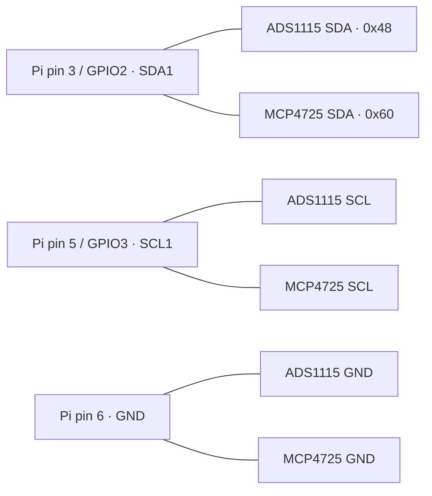

# VacDepoctrl — Raspberry Pi 5 pin diagram

Physical header numbers are in the middle; GPIO names use BCM numbering.
View from above the header, with the pin-1 end at the top and odd pins on the
left. Locate pin 1 on the board before wiring; this is not the underside view.

```text
                         PIN-1 END
                          ┌───────┐
                  3.3 V   │ 1   2 │   5 V
 ADC + DAC SDA ← GPIO2    │ 3   4 │   5 V
 ADC + DAC SCL ← GPIO3    │ 5   6 │   GND → ADC + DAC ground
                 GPIO4    │ 7   8 │   GPIO14
                   GND    │ 9  10 │   GPIO15
  Turbo enable ← GPIO17   │11  12 │   GPIO18
     MFC close ← GPIO27   │13  14 │   GND
   Turbo valve ← GPIO22   │15  16 │   GPIO23 — former SDA; disconnect
                  3.3 V   │17  18 │   GPIO24 — former SCL; disconnect
                GPIO10    │19  20 │   GND
                 GPIO9    │21  22 │   GPIO25
                GPIO11    │23  24 │   GPIO8
                   GND    │25  26 │   GPIO7
           GPIO0 / ID_SD  │27  28 │   GPIO1 / ID_SC
                 GPIO5    │29  30 │   GND
                 GPIO6    │31  32 │   GPIO12
                GPIO13    │33  34 │   GND
                GPIO19    │35  36 │   GPIO16
                GPIO26    │37  38 │   GPIO20
                   GND    │39  40 │   GPIO21
                          └───────┘
```

Unmarked GPIOs have no assignment in the current controller configuration;
that does not establish whether a fitted HAT uses them. Pins 27/28 are the HAT
identification interface. Power pins are shown for orientation, not as an
instruction to change module power wiring.

## Shared I2C wiring



Both devices share hardware bus **1**, configured for **100 kHz**. Power down
before moving the previous SDA/SCL wires from physical **16/18 → 3/5**.
Keep bus pull-ups at **3.3 V**, never 5 V. This diagram covers signal wiring;
retain the verified module supply and analog conditioning circuits.

## Control and analog connections

| Signal | Connection | Behavior / notes |
|---|---|---|
| Turbo enable | Pin 11 / GPIO17 → opto input circuit | HIGH enables; LOW disables |
| MFC emergency close | Pin 13 / GPIO27 → valve-close interface | LOW forces close; input mode releases override |
| Turbo inlet valve | Pin 15 / GPIO22 → BC547 relay driver | HIGH opens; LOW closes, per existing NC-contact wiring |
| Pirani pressure | Conditioned gauge output → ADS1115 A0 | Existing 0–10 V to 0–3.3 V divider |
| MFC flow feedback | Conditioned feedback → ADS1115 A1 | Existing input divider |
| Turbo RPM | Conditioned tach output → ADS1115 A2 | Configured 0–3.3 V range |
| MFC setpoint | MCP4725 OUT → existing buffer/gain stage → MFC | Configured 0–5 V output range after conditioning |
| PZEM meter | CP2102 USB serial adapter → Pi USB | Not a GPIO-header UART connection |

Control GPIOs connect to the existing interface circuits, not directly to coils
or high-voltage equipment. ESP32 autotransformer wiring is still being planned
and is not assigned here.

Source of controller assignments: [config.py](../config.py),
[Pirani driver](../drivers/pirani.py), and [MFC driver](../drivers/mfc_control.py).
Header reference: [Raspberry Pi GPIO documentation](https://www.raspberrypi.com/documentation/computers/raspberry-pi.html#gpio).
